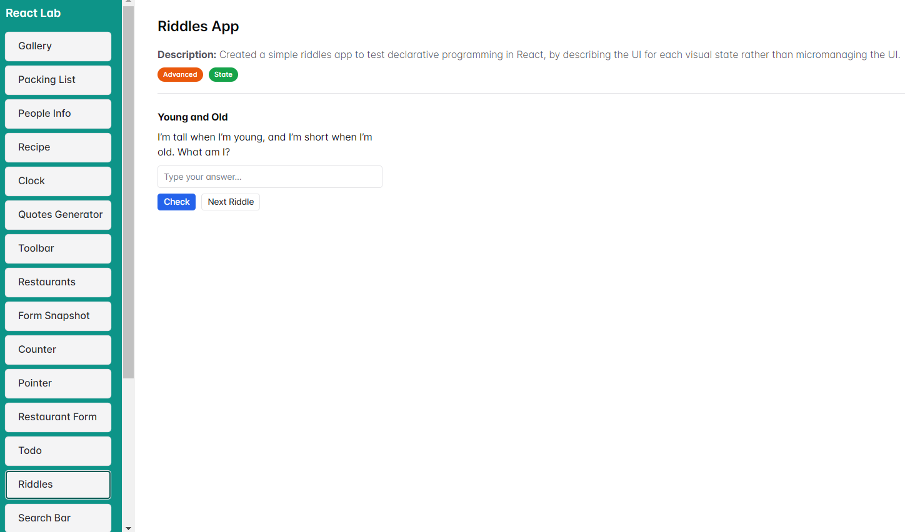

# React Lab

A personal playground of mini React apps and experiments.  
**ReactLab** is a modular project designed to explore, test, and showcase a variety of React features, libraries, and patterns — all in one place.

---

## Features

- Built with **React** and **Vite**.
- Multiple mini-apps in one project.
- Showcases common React patterns and hooks.
- A great place to experiment and learn.
- You can easily add your own mini apps and test them.
- You can also display badges indicating which React features are used in the app.

---

## Featured Mini Apps

- **Quotes Generator** – Simple state management with `useState`
- **Theme Toggle** – Context API with dark/light mode
- **Search Bar** – Real-time list filtering applying state lifting
- **Advanced Todo** – More advanced state management using a reducer/context combination.
- **Performance Loop** – Performance test using `useMemo`
- **Contacts** - Add, view, edit, and delete phone contacts.
- and more...

---

## Installation

```bash
git clone https://github.com/baraa-elhajj/React-Lab.git
cd react-lab
npm install
npm run dev
```

Make sure you have [Node.js](https://nodejs.org/) and [Vite](https://vitejs.dev/) installed.

---

## How to add your own mini app

1. Create your main jsx component in `src/apps` repository.
2. Import your component in `src/AppsMap.jsx` file.
3. Add your component to the `appsMap` map, e.g. `MyComponentName: <MyComponent />`
4. Now your mini app is added. Run the project and check it out in the list of apps in the left panel.

---

## Technologies Used

- React + Vite
- JavaScript / JSX
- ESLint
- [ChakraUI](https://chakra-ui.com/)
- [Lucide](https://lucide.dev/) and React Icons
- Some useful vscode extensions like [Prettier](https://marketplace.visualstudio.com/items?itemName=esbenp.prettier-vscode) and [FileTree Pro](https://marketplace.visualstudio.com/items?itemName=0xTanzim.filetree-pro)

---

## Preview

### Main Preview



### Multiple Mini-apps


---

## Contributing

This is a personal lab, but feel free to fork it or suggest improvements if you find something cool!

---

## License

MIT License. You are free to use or adapt this lab for learning purposes.
